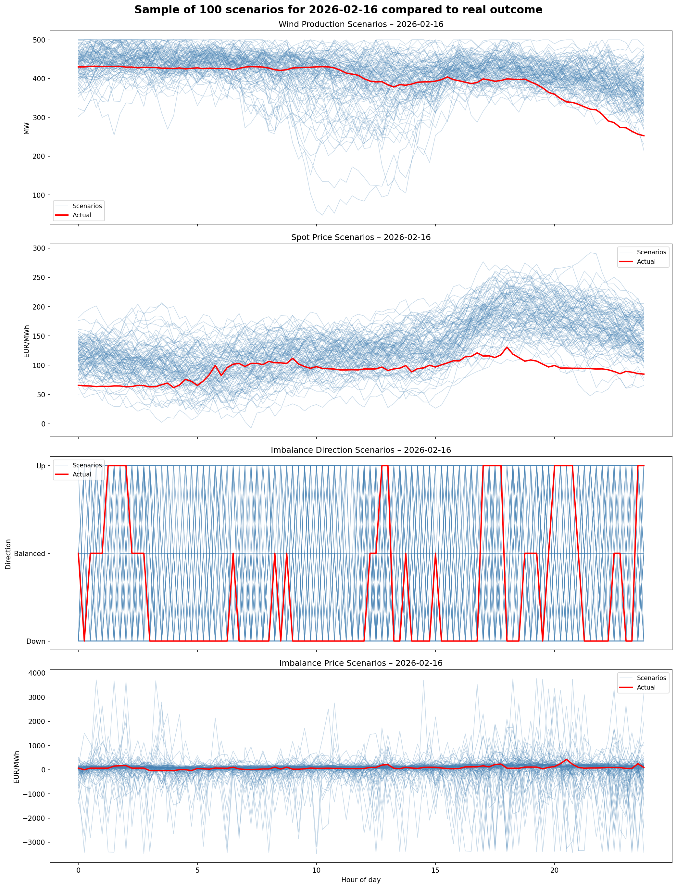
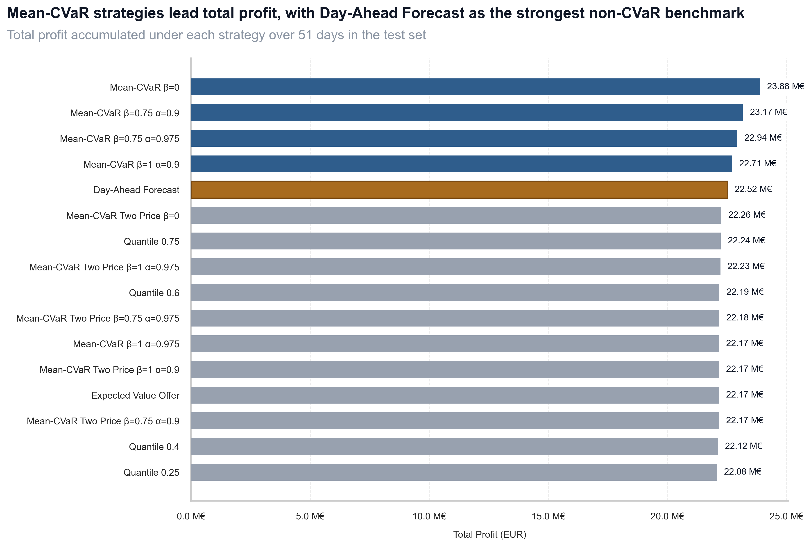
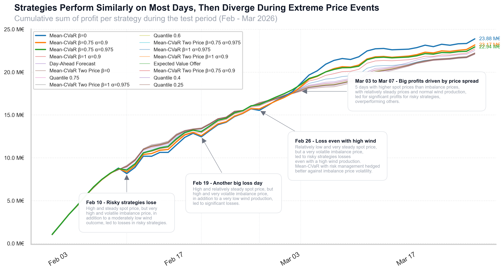
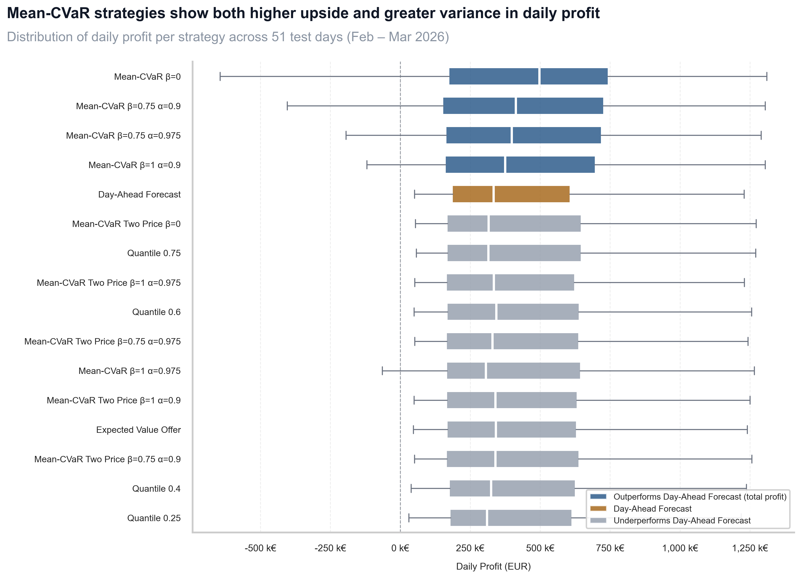
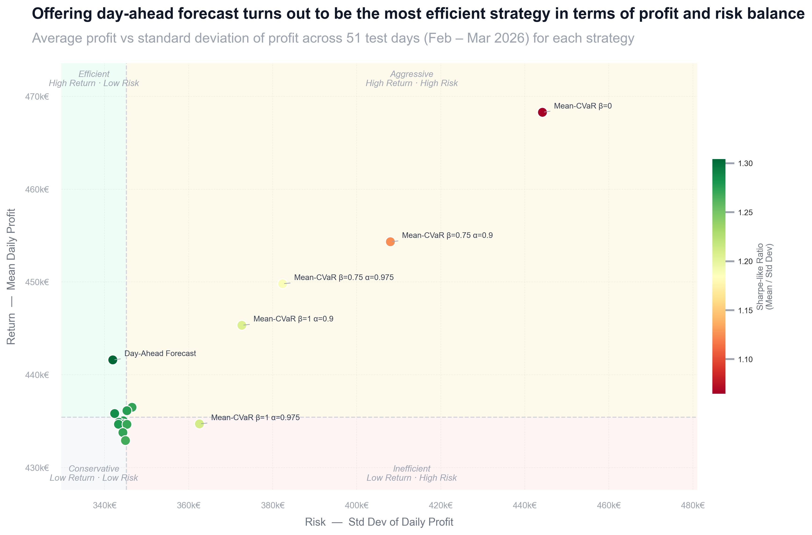

# Analysis of strategies to offer offshore wind power in the day-ahead market

## Motivation

Wind farms are increasingly participating in electricity markets, and their offering strategies can significantly impact their profitability. This project presents a setup to compare different strategies for an offshore wind farm participating in the day-ahead and balancing markets. Comparisons evaluate the trade-off between expected profit and risk.

## Methodology

The setup is proposed exclusively for a hypothetical offshore wind farm of 500 MW located in Denmark (DK2 bidding zone). Data is collected from Energinet, including historical spot and imbalance prices, as well as wind power forecasts and actual production for the period of March 2025 to March 2026 in a 15-minutes resolution. 

The following are the critical assumptions of the setup:

- The wind farm is a price taker in the market, meaning it cannot influence market prices with its offers. The price offered in the day-ahead market is always 0 and assumed to be accepted in full.
- The wind farm can only offer in the day-ahead market, and cannot adjust its offer after observing the actual production or market prices.
- The wind farm is not subject to any penalties or costs other than the imbalance settlementm, which is considered a One Price Imbalance Settlement.
- [critical] The wind farm imbalance does not affect the imbalance price nor the imbalance direction.
- [critical] Offshore wind farm production comes from total real offshore wind production in DK2, scaled to 500 MW. This means that curtailment or other operational events that might be correlated to spot or imbalance prices are embedded in the data. Furthermore, it reduces wind variability compared to a single wind farm, which might affect the results of the strategies.

The analysis consists in 5 steps:

1. **Data collection and Exploration**: Identify potential data sources and perform exploratory data analysis.
2. **Scenario generation**: Generate 1600 scenarios of spot price, imbalance price, imbalance direction, and wind power production given the available data one day before the delivery day. Generators are trained using data from March 2025 to January 2026, and tested on 51 days in February and March 2026.
3. **Strategy Definition**: Define a set of offering strategies based on deterministic approaches or stochastic optimization.
4. **Strategy Evaluation**: Evaluate the performance of each strategy in the test set of 51 days, using the generated scenarios to compute the expected profit and risk (standard deviation of profit) for each strategy.

Figure 1 shows an example of the generated scenarios for a given delivery day, including spot price, imbalance price, imbalance direction and wind power production.

*Figure 1: Generated scenarios for a delivery day with spot price, imbalance price, imbalance direction, and wind power production.*

## Key findings

Mean-CVaR strategies optimised for One Price Imbalance Settlement capture more profit over the test period than the rest, except for the combination of α=0.975 and β=1 (the most conservative strategy of that type). Surprisingly, the next best strategy is offering the day-ahead forecast, which yields considerably higher profit than the remaining strategies. The ranking is shown in Figure 2.

*Figure 2: Ranking of strategies based on total profits captured during the test period.*

Examining the profit evolution across the test period (Figure 3), strategies perform similarly on most days, but certain events of extreme or volatile prices lead to significant differences in profit. For instance, on 10th February 2026, a day with high and volatile imbalance prices caused risky strategies to lose a large amount of profit, while more conservative strategies mitigated those losses. On the other hand, five consecutive days in March with stable prices allowed risky strategies to capture much more profit, compensating for their earlier losses and surpassing the other strategies.

*Figure 3: Profit evolution for selected strategies with annotations of events with high differences per strategy.*

Although Mean-CVaR strategies show better performance in terms of total profit, they also exhibit higher variability in profit across days compared to other strategies, as shown in Figure 4. Their exposure to volatile imbalance prices even leads them to experience losses on some days. The day-ahead forecast strategy, on the other hand, shows a more consistent profit interval across days while capturing a high average profit. 
 
 
*Figure 4: Box-plots respresenting the distribution of profits across the 51 test days for each strategy. Boxes contain the interquartile range (IQR), whiskers extend to 1.5 times the IQR, and outliers are shown as individual points. Midline represents the median.*

When evaluating the return vs. risk of each strategy (Figure 5), offering the day-ahead forecast emerges as the most efficient strategy in terms of profit and risk balance.

 
*Figure 5: Return vs. Risk per strategy. Each point is a strategy; color encodes the Sharpe-like ratio (mean / std dev). Quadrants split at median risk and return across all strategies.*

## Discussion of key points

Day-ahead offering appears to be the best strategy in terms of profit and risk balance, however it might be related to data limitations. The setup assumes no relationship between day ahead forecast and actual production with market prices, which might not hold in reality, giving an advantage to the day-ahead forecast strategy. 

The fact that Mean-CVaR strategies work as expected reveals that scenarios created are working well. This is allowing risky strategies to "gamble" on market prices which is generating higher profits on average.  However, the critical assumption of own imbalance not affecting imbalance price nor imbalance direction is a strong assumption that likely does not hold in reality for a wind farm of 500 MW. This assumption might be giving an advantage to more risky strategies, since they are more exposed to imbalance prices and directions, but they are not affected by their own imbalance.

## Conclusions and future work

This project establishes an end-to-end framework for comparing offering strategies for offshore wind farms in the day-ahead and balancing markets. The pipeline spans data collection, scenario generation, strategy definition, and evaluation of realised outcomes over a test period, providing a structured basis for assessing the profitability and risk of each strategy. The framework demonstrates that stochastic optimization methods behave as expected, with Mean-CVaR strategies responding predictably to their risk parameters, which validates the overall design. This methodology is modular and adaptable, providing a foundation for comparing a wide range of strategies. 

With targeted improvements, this framework has the potential to support real-world decision-making for wind farm operators. The current results are constrained by simplifying assumptions, most notably the use of aggregated DK2 offshore production (and their forecasts) as a proxy for a single farm, and the exclusion of the farm's own impact on system imbalance. Addressing these would change the relative performance of the strategies and produce findings that are more directly actionable. 

Scenario generation is a field of study on its own, and could be improved from both data and modelling perspectives. Incorporating weather variables into spot price prediction, performing a deeper exploratory analysis of the relationships between all input variables, and validating scenarios against realised outcomes through rigorous benchmarking would all improve the quality of the stochastic inputs. Furthermore, training on a larger dataset and evaluating strategies over a longer and more diverse test period, covering different seasons and market regimes, would allow conclusions about the temporal stability of the results and reduce the risk of overfitting to a specific market period.

The same frameworkk could be improved to include more strategies, markets and technologies. Including additional optimisation approaches such as robust optimisation, min-max regret, and minimum-variance strategies would enrich the comparison and expose different aspects of the risk-return trade-off. Extending participation to the continuous intraday market, discrete intraday auctions, and reserve capacity markets would reflect the multi-market reality faced by wind farm operators. Finally, this methodology could be adapted to other renewable technologies such as solar PV, onshore wind and even storage with some modifications, making it a versatile tool for renewable energy market analysis.